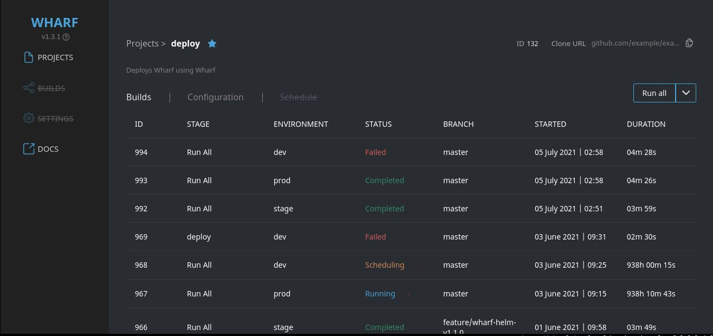

# Wharf Angular frontend

[](https://www.codacy.com/gh/iver-wharf/wharf-web/dashboard?utm_source=github.com\&utm_medium=referral\&utm_content=iver-wharf/wharf-web\&utm_campaign=Badge_Grade)



## Prerequisites

- **NPM v6.x.x,** which comes with Node.js LTS.

  This is because Angular does not support Node.js Current, and recently they
  got an incompatability with Node.js v16 / NPM v7.

  Read more about it here:
  <https://github.com/angular/angular-cli/issues/19957#issuecomment-775407654>

## Building project

The project requires api-client library and `import-*` provider libraries to be
built first.

1. Get dependencies

   ```console
   $ npm install
   ```

2. Build API client libraries

   ```console
   $ npm run build-clients
   ```

3. Build and start server

   ```console
   $ npm start
   ```

## Generate models and services

In case you need to regenerate the api clients, run the
`./generate-rest-client.ps1` script in powershell:

- Windows:

  ```powershell
  PowerShell.exe -ExecutionPolicy Bypass -File ./generate-rest-client.ps1
  ```

- Linux:

  1. Install PowerShell Core, for example by following a guide from <https://docs.microsoft.com/en-us/powershell/scripting/install/installing-powershell-core-on-linux>
     or by installing .NET SDK and installing it via the `dotnet` CLI
     (installed via <https://dotnet.microsoft.com/download?initial-os=linux>)
     by running:

     ```console
     $ dotnet tool install --global powershell
     ```

  2. Now you can run the script:

     ```console
     $ ./generate-rest-client.ps1
     ```

## Run locally via Docker

Use [GNU Make](https://www.gnu.org/software/make/) or [GNUWin32](http://gnuwin32.sourceforge.net/install.html).

1. Build the docker image:

   ```console
   $ make docker
   ```

2. Run the built docker image:

   ```console
   $ make docker-run
   ```

Visit <http://localhost:8080/>

## Releasing

Replace the "v2.0.0" in `make docker version=v2.0.0` with the new version. Full
documentation can be found at [Releasing a new version](https://iver-wharf.github.io/#/development/releasing-a-new-version).

Below are just how to create the Docker images using [GNU Make](https://www.gnu.org/software/make/)
or [GNUWin32](http://gnuwin32.sourceforge.net/install.html):

```console
$ make docker version=v2.0.0
[1/2] STEP 1/13: FROM node:14.17.1-alpine3.11 AS build
Trying to pull docker.io/library/node:14.17.1-alpine3.11...
Getting image source signatures
Copying blob ed2a3f372ee3 skipped: already exists
Copying blob 5ec9f1d3bd97 skipped: already exists
Copying blob d222216fa792 skipped: already exists
Copying blob ddad3d7c1e96 [--------------------------------------] 0.0b / 0.0b
Copying config 58466d7cb9 done
Writing manifest to image destination
Storing signatures
[1/2] STEP 2/13: WORKDIR /usr/src/app
...

Push the image by running:
docker push quay.io/iver-wharf/wharf-web:latest
docker push quay.io/iver-wharf/wharf-web:v2.0.0
```

## Linting from command-line

```sh
make deps

make lint

make lint-ng # Only run Angular/TypeScript linting
make lint-scss # Only run SCSS linting
make lint-md # Only run Markdown linting
```

Some linting errors have quickfixes, such as "missing semicolon" or
"invalid indentation" which can be fixed without messing up the semantics of the
code. These can be fixed by running the following:

```sh
make lint-fix

make lint-fix-ng # Only fix Angular/TypeScript lint errors
make lint-fix-scss # Only fix SCSS lint errors
make lint-fix-md # Only fix Markdown lint errors
```

A lot of other errors, such as "member should be camelCased", is not fixable by
this `make lint-fix` command. For those, you'll have to fix them manually.

## Linting from IDE

> First make sure the project builds by following the [#Building project](#building-project)
> guide above.

### Linting from Visual Studio Code

1. Install extensions

   - ESLint (`dbaeumer.vscode-eslint`): <https://marketplace.visualstudio.com/items?itemName=dbaeumer.vscode-eslint>
   - vscode-remark-lint (`vscode-remark-lint`): <https://marketplace.visualstudio.com/items?itemName=drewbourne.vscode-remark-lint>
   - stylelint (`stylelint.vscode-stylelint`): <https://marketplace.visualstudio.com/items?itemName=stylelint.vscode-stylelint>

   > :warning: The `vscode-remark-lint` extension has not proven itself to work
   > previously. If it does not work correctly for you, then skip it and rely
   > on the command-line linting instead.

2. Install NPM dependencies (required by stylelint):

   ```sh
   npm install
   ```

3. Open a `*.ts` file

4. Click the "🚫 ESLINT" tab in the bottom right toolbar and then select
   either "Enable" or "Enable everywhere"

   

5. Done!

   

### Linting from vim/neovim

1. Install plugins:

   - [coc.nvim](https://github.com/neoclide/coc-eslint)
   - [ALE](https://github.com/dense-analysis/ale)

   > :warning: Warning: coc.nvim is not that well compatible with other
   > autocompletion plugins, such as YouCompleteMe, deoplete, etc. Use at your
   > own risk.

2. Configure coc.nvim & ALE to play well together

   1. Add the following to your vim config (`~/.config/{vim,nvim}/init.vim`)

      ```vim
      let g:ale_disable_lsp = 1
      ```

   2. Add this to your coc.nvim config (open it with `:CocConfig`):

      ```json
      "diagnostic.displayByAle": true
      ```

3. Install coc.nvim extensions

   - [`coc-eslint`](https://github.com/neoclide/coc-eslint)
   - [`coc-stylelint-plus`](https://github.com/bmatcuk/coc-stylelintplus)

   ```vim
   :CocInstall coc-eslint
   :CocInstall coc-stylelintplus
   ```

4. Install NPM dependencies (required by stylelint):

   ```sh
   npm install
   ```

5. Open a `*.ts` file

6. Open the `coc-eslint` output to see the options to enable it

   ```vim
   :CocCommand eslint.showOutputChannel
   ```

7. Done!

   

## Project style guides

- Do not set public members explicitly
- If you can define as many members as possible as private
- If possible use interface instead of class for data contract

---

Maintained by [Iver](https://www.iver.com/en).
Licensed under the [MIT license](./LICENSE).
