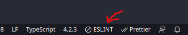
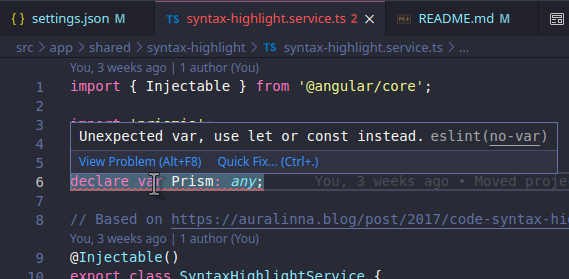
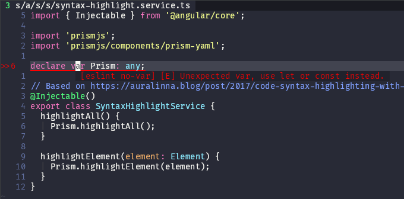

# Wharf Angular frontend

[](https://www.codacy.com/gh/iver-wharf/wharf-web/dashboard?utm_source=github.com&amp;utm_medium=referral&amp;utm_content=iver-wharf/wharf-web&amp;utm_campaign=Badge_Grade)

## Prerequisites

- **NPM v6.x.x,** which comes with Node.js LTS.

  This is because Angular does not support Node.js Current, and recently they
  got an incompatability with Node.js v16 / NPM v7.

  Read more about it here:
  <https://github.com/angular/angular-cli/issues/19957#issuecomment-775407654>

## Building project

The project requires api-client library and `import-*` provider libraries to be
built first.

1. Get dependencies

   ```bash
   npm install
   ```

2. Build API client libraries

   ```bash
   npm run build-clients
   ```

3. Build and start server

   ```bash
   npm start
   ```

## Generate models and services

In case you need to regenerate the api clients:

1. Go to backend directory api

2. Regenerate swagger api.

   ```powershell
   swag init
   ```

3. Do steps `1.` and `2.` for github and gitlab and azuredevops

4. Run the api on the default 5000 port on your localhost

5. After that you just have to run the `./generate-rest-client.ps1` script in
   powershell:

   - Windows:

     ```powershell
     PowerShell.exe -ExecutionPolicy Bypass -File ./generate-rest-client.ps1
     ```

   - Linux:

     1. Install .NET SDK: <https://dotnet.microsoft.com/download?initial-os=linux>

     2. Make sure you add the path to .NET tools to your `$PATH` by adding the
        following to your `~/.bashrc`, `~/.zshenv`, etc:

        ```sh
        # Dotnet tools
        export PATH="$PATH:$HOME/.dotnet/tools"
        ```

     3. Install PowerShell Core via `dotnet tool`

        ```sh
        dotnet tool install --global powershell
        ```

     4. Now you can run the script:

        ```sh
        ./generate-rest-client.ps1
        ```

## Linting from command-line

```sh
npm install

npm run lint

# Only run Angular/TypeScript linting
npm run lint-ng

# Only run SCSS linting
npm run lint-scss

# Only run Markdown linting
npm run lint-md
```

Some linting errors have quickfixes, such as "missing semicolon" or
"invalid indentation" which can be fixed without messing up the semantics of the
code. These can be fixed by running the following:

```sh
npm run lint-fix

# Only fix Angular/TypeScript lint errors
npm run lint-ng-fix

# Only fix SCSS lint errors
npm run lint-scss-fix

# Only fix Markdown lint errors
npm run lint-md-fix
```

A lot of other errors, such as "member should be camelCased", is not fixable by
this `npm run lint-fix` command. For those, you'll have to fix them manually.

## Linting from IDE

> First make sure the project builds by following the [#Building project](#building-project)
> guide above.

### Linting from Visual Studio Code

1. Install extensions

   - ESLint (`dbaeumer.vscode-eslint`): <https://marketplace.visualstudio.com/items?itemName=dbaeumer.vscode-eslint>
   - vscode-remark-lint (`vscode-remark-lint`): <https://marketplace.visualstudio.com/items?itemName=drewbourne.vscode-remark-lint>
   - stylelint (`stylelint.vscode-stylelint`): <https://marketplace.visualstudio.com/items?itemName=stylelint.vscode-stylelint>

   > :warning: The `vscode-remark-lint` extension has not proven itself to work
   > previously. If it does not work correctly for you, then skip it and rely
   > on the command-line linting instead.

2. Install NPM dependencies (required by stylelint):

   ```sh
   npm install
   ```

3. Open a `*.ts` file

4. Click the "🚫 ESLINT" tab in the bottom right toolbar and then select
   either "Enable" or "Enable everywhere"

   

5. Done!

   

### Linting from vim/neovim

1. Install plugins:

   - [coc.nvim](https://github.com/neoclide/coc-eslint)
   - [ALE](https://github.com/dense-analysis/ale)

   > :warning: Warning: coc.nvim is not that well compatible with other
   > autocompletion plugins, such as YouCompleteMe, deoplete, etc. Use at your
   > own risk.

2. Configure coc.nvim & ALE to play well together

   1. Add the following to your vim config (`~/.config/{vim,nvim}/init.vim`)

      ```vim
      let g:ale_disable_lsp = 1
      ```

   2. Add this to your coc.nvim config (open it with `:CocConfig`):

      ```json
      "diagnostic.displayByAle": true
      ```

3. Install coc.nvim extensions

   - [`coc-eslint`](https://github.com/neoclide/coc-eslint)
   - [`coc-stylelint-plus`](https://github.com/bmatcuk/coc-stylelintplus)

   ```vim
   :CocInstall coc-eslint
   :CocInstall coc-stylelintplus
   ```

4. Install NPM dependencies (required by stylelint):

   ```sh
   npm install
   ```

5. Open a `*.ts` file

6. Open the `coc-eslint` output to see the options to enable it

   ```vim
   :CocCommand eslint.showOutputChannel
   ```

7. Done!

   

## Project style guides

- Do not set public members explicitly
- If you can define as many members as possible as private
- If possible use interface instead of class for data contract

## Run locally via Docker

```sh
docker build . -t wharf_web-ng \
  --build-arg WHARF_WEB_VERSION='local docker' \
  --build-arg WHARF_WEB_CI_GIT_COMMIT=$(git log -n 1 --format=%H) \
  --build-arg WHARF_WEB_CI_BUILD_REF=0

docker run --rm -it -p 8080:8080 wharf_web-ng
```

Visit <http://localhost:8080/>

---

Maintained by [Iver](https://www.iver.com/en).
Licensed under the [MIT license](./LICENSE).
